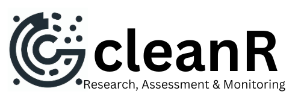

<!-- README.md is generated from README.Rmd. Please edit that file -->

```{r, include = FALSE}
knitr::opts_chunk$set(
  collapse = TRUE,
  comment = "#>",
  fig.path = "man/figures/README-",
  out.width = "100%"
)
```

# cleanR 

<!-- badges: start -->

<!-- badges: end -->

**cleanR** is data cleaning tool designed to simplify and enhance WFP data cleaning process. it enables users to load raw data and perform essential data quality checks including survey time completion, identification of missing data points, handling of non-standard responses, detection of outliers, pinpointing inconsistencies and validation of GPS coordinates. the package adopts variable naming standards from the [WFP Survey Designer](https://www.surveydesigner.vam.wfp.org/) for consistency and compatibility. at the end, users can efficiently prepare their data for analysis. ensuring accuracy and reliability.

## Installation

You can install the development version of cleanR from GitHub:

``` r
# install.packages("devtools")
remotes::install_github("axmedmaxamuud/cleanR")
```

## Usage

### Step 1: Create blank logbook

This is a basic example of creating a blank logbook that you can use it later to save the observation with issues.

```{r, message=FALSE}
library(cleanR)

# create the logbook
my_logbook <- logbook()

# inspect the head of the logbook
head(my_logbook)

```

### Step 2: Log issues in the logbook

Now you can inspect the data and use the log_issue() to write the observations of the data that you find with the issues in the logbook.

```{r}
check_age <- survey_data %>% 
  filter(RESPAge < 15) %>% 
  log_sheet(question.name = "ki_age",
            issue = "respondent is under 15 years old",
            action = "delete")
# inspect the check_age data
head(check_age)

```

now you can merge the check_age data with the logbook so you can maintain one logbook that can be exported at the end.

```{r}
my_logbook <- rbind(my_logbook, check_age)

head(my_logbook)
```

## Feedback & Contributions

we welcome your feedback and contributions to make cleanR even more interactive and robust. feel free to report issues or contribute to the project by making pull request.


## Reference

This work draws inspiration from the [HighFrequencyChecks](https://unhcr.github.io/HighFrequencyChecks/docs/), [IMPACT cleaninginspectoR](https://github.com/impact-initiatives/cleaninginspectoR) and [WFP DataBreiges](https://databridges.vam.wfp.org/). by building on the foundation laid by these packages, cleanR seeks to streamline the process and make it relevant to WFP programming.


